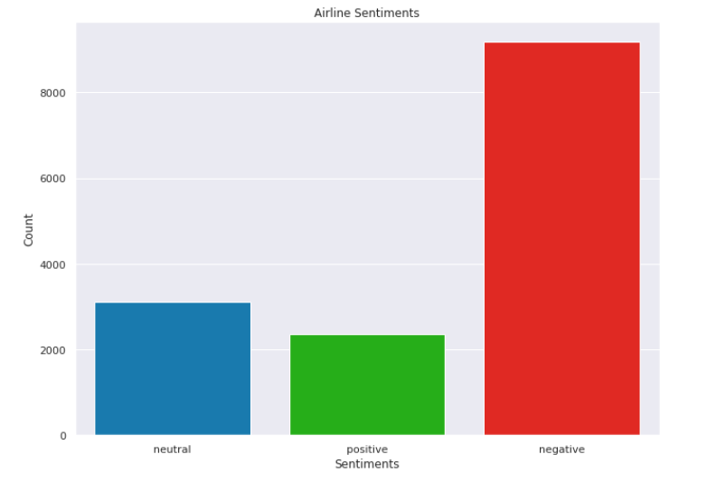
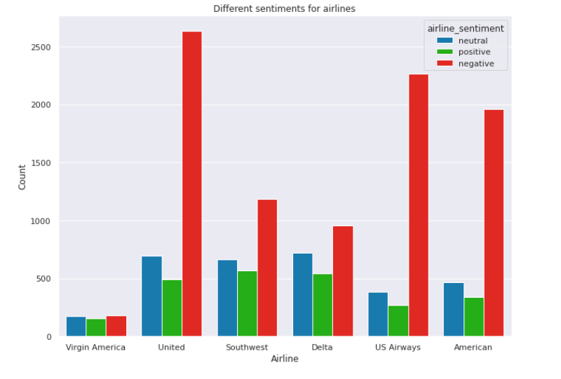

# Sentiment Analysis of Airline tweets using Random Forest classification

<b> Libraries to import: </b>

    import pandas as pd 
    import re  
    import nltk 
    nltk.download('stopwords')  
    from nltk.corpus import stopwords 

    import seaborn as sns
    import matplotlib.pyplot as plt
    import re

    from sklearn.feature_extraction.text import TfidfVectorizer 
    from sklearn.model_selection import train_test_split  
    from sklearn.ensemble import RandomForestClassifier
    from sklearn.metrics import classification_report, confusion_matrix, accuracy_score
    
<b> Steps in the notebook:</b>

    1. Data set preparation
    2. Exploratory Data Analysis
    3. Data Preprocessing
    4. TF-IDF generation
    5. Training and Validation
    
 
 
